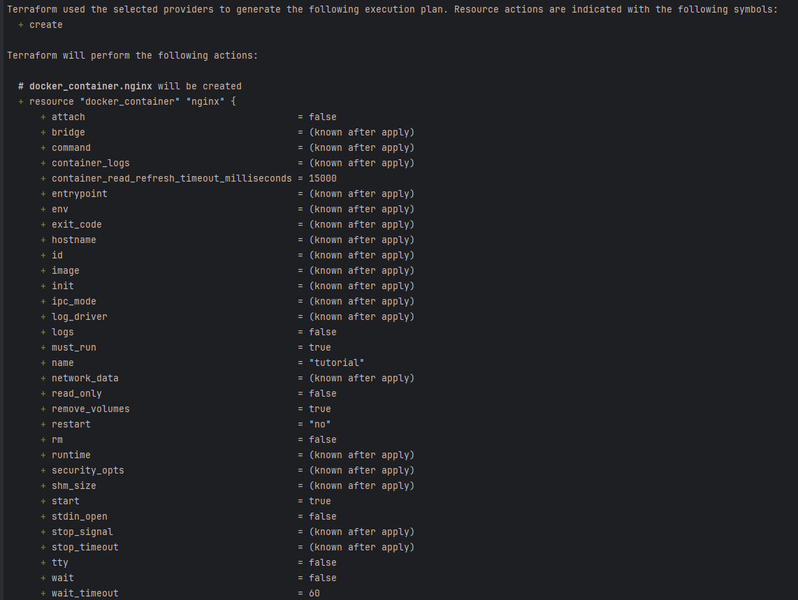
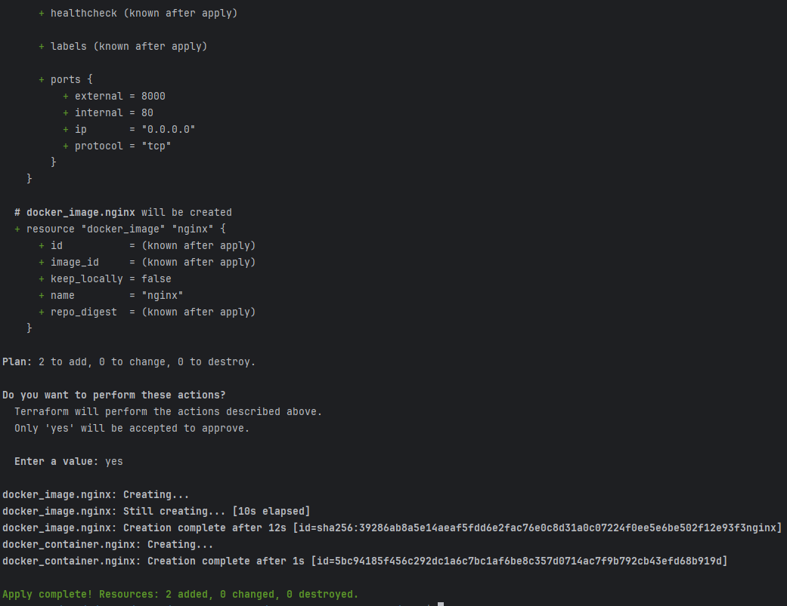
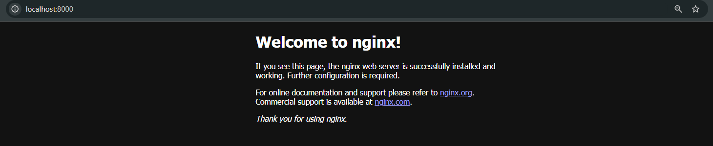
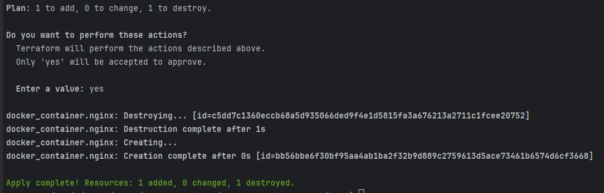
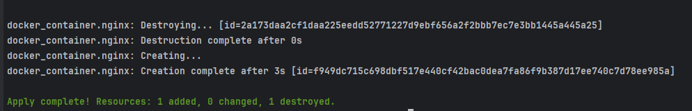
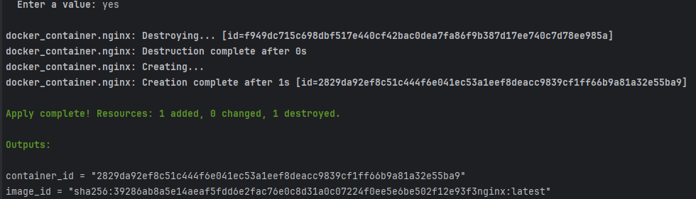
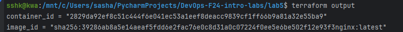

## Task 2: Terraform Installation and Nginx Deployment
Terraform is an open-source infrastructure as code software tool. 
Infrastructure as Code (IaC) tools allow users to manage infrastructure with simple declarative language.
Terraform manages external resources such as cloud infrastructure, network appliances, 
software as a service.

### Version of Terraform Installed: v1.9.6

### Installation
```sudo apt-get update && sudo apt-get install -y gnupg software-properties-common```

```shell
wget -O- https://apt.releases.hashicorp.com/gpg | \
gpg --dearmor | \
sudo tee /usr/share/keyrings/hashicorp-archive-keyring.gpg > /dev/null
```

```shell
gpg --no-default-keyring \
--keyring /usr/share/keyrings/hashicorp-archive-keyring.gpg \
--fingerprint
```
Output:


etc.

```shell
echo "deb [signed-by=/usr/share/keyrings/hashicorp-archive-keyring.gpg] \
https://apt.releases.hashicorp.com $(lsb_release -cs) main" | \
sudo tee /etc/apt/sources.list.d/hashicorp.list

```
Output:


```shell
sudo apt update
```
```shell
sudo apt-get install terraform
```

Terraform installation successfully completed:


Additionally, I have enabled autocomplete for Terraform:

```shell
touch ~/.bashrc
terraform -install-autocomplete
```

### Initialization and application of Terraform configuration

#### Build
```shell
mkdir lab5
cd lab5
```
After that I have added a main.tf with Nginx deployment configuration and executed the following commands:

```shell
terraform init
```


```shell
terraform apply
```





Now, we can check the Nginx container running on the specified port:


And in browser:


#### Change configuration
To apply changes: firstly, modify the main.tf file (I have changed the external port, then execute the following commands:
```shell
terraform apply
```


#### Destroy infrastructure
To destroy the infrastructure, I have executed the following command:
```shell
terraform destroy
```


#### Define variables
I have added a variable.tf file with a variable for container name and added to the main.tf a line "name  = var.container_name".

Now:
```shell
terraform apply
```


and with defining a custom container name:
```shell
terraform apply -var "container_name=YetAnotherName"
```




#### Define outputs
After defining ouputs.tf file, after terraform apply command, we can see the output of the container name:
```shell
terraform apply
```



Also, we can see the outputs of applied changes:
```shell
terraform output
```



No big problems were encountered during the installation and deployment process. The whole process went smoothly.