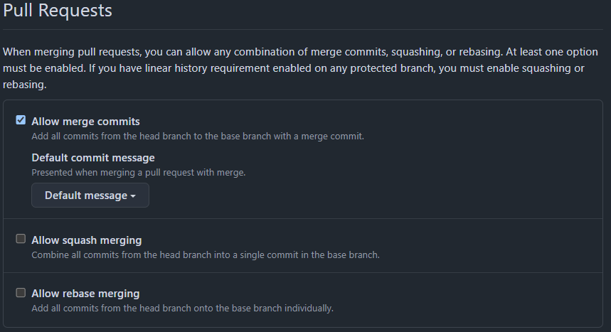

# Task 1: SSH Commit Signature Verification
By signing commits in Git, we can guarantee that a commit has been done from a trusted source. 
The difference from not signing commits is that unsigned commits allow to state any author for a commit.
That way, with cryptographically signing commits we can verify our authorship over a specific commit, 
and GitHub will also display a 'Verified' tag in the repo. If the author is not correct, 
GitHub will allow to commit, but will state the commit is "Unverified".

# Task 2: Merge Strategies in Git
## Comparing merge strategies
1. Standard Merge\
All commits from the source branch are added to the target branch in a merge commit.
This strategy is often preferred in collaborative environments. 
Firstly, it is easy to see what exact change was made by each contributor, 
because the history of individual commits is saved in the target branch.
Secondly, the moment of merging the feature into the base branch is being stored, 
thus it is convenient to see the history of adding specific features, 
and it is not complicated to revert changes by reverting merge commit in a target branch.
    - Pros: 
      - All of each contributor individual commits from a merged branch are seen in the target branch after merge.
      - Easy to see the point of adding a new feature, easy to revert.
    - Cons: 
      -  In some cases, this strategy can be excessive, for example, when we want to maintain clear or linear Git history, and when storing individual commits or merge commits is not needed.

2. Squash and Merge\
Combines all commits from a feature branch into a single commit before merging.
This strategy can be used when it is not important to save all individual commits from the source branch, 
and it is more important to maintain clear change history.
    - Pros:
      - Clear Git history can be maintained. 
      - A point of merge a feature to the base branch is saved in history.
    - Cons: 
      - Individual commits from the merged branch are not seen in the target branch after merge.

3. Rebase and Merge\
Basically, all commits from the source branch are added one by one to the target branch without creating a merge commit.
    - Pros:
      - Linear history can be maintained. 
    - Cons: 
      - It is not possible to save the moment when a new feature was added to the main branch.
      - Thus, it is not straightforward to revert a change from rebasing.
## Repository settings
