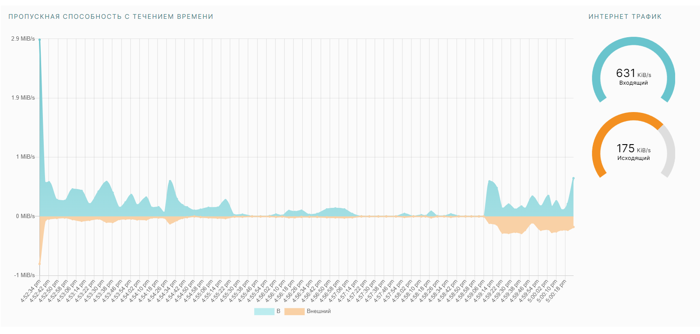
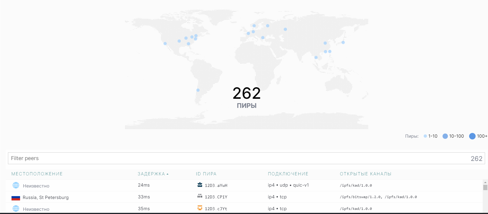

## Task 1

### Bandwidth

During 5 minutes interval:
Incoming traffic: 23 KiB/s - 670 KiB/s
Outgoing traffic: 22 KiB/s - 200 KiB/s

### Peers

184-430 peers during a 5 minutes interval.

### Uploaded file
File name: wallpaperflare.com_wallpaper (1).jpg
CID Hash code: QmejygXqVxgjza5Rcjm73QHoJYZ1fJk7ZuEH7QDg89RU7F
Urls:
- https://ipfs.io/ipfs/QmejygXqVxgjza5Rcjm73QHoJYZ1fJk7ZuEH7QDg89RU7F
- https://cloudflare-ipfs.com/ipfs/QmejygXqVxgjza5Rcjm73QHoJYZ1fJk7ZuEH7QDg89RU7F
- https://ipfs.infura.io/ipfs/QmejygXqVxgjza5Rcjm73QHoJYZ1fJk7ZuEH7QDg89RU7F

## Task 2

IPFS Links: 
- https://bafybeibvmo2xvgtdj6lgtbebaoe4xcmnmqa2bz56al65t45qj3shdmegi4.ipfs.flk-ipfs.io/
- https://ipfs.io/ipfs/bafybeibvmo2xvgtdj6lgtbebaoe4xcmnmqa2bz56al65t45qj3shdmegi4/
- https://bafybeibvmo2xvgtdj6lgtbebaoe4xcmnmqa2bz56al65t45qj3shdmegi4.ipfs.dweb.link/

Domain: https://melodic-air-young.on-fleek.app/
