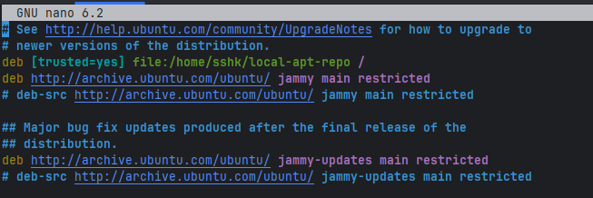

## Task 1: Configure and Use a Local Package Repository

### 1. Create a repository and download a gedit deb package.
```sh
mkdir -p ~/local-apt-repo
cd local-apt-repo/
sudo wget http://archive.ubuntu.com/ubuntu/pool/main/g/gedit/gedit_41.0-3_amd64.deb
```

### 2. Generate package index
I have created a Packages file instead of Packages.gz file, due to some errors occuring during installation in further steps.
```sh
dpkg-scanpackages -m . > Packages
```

### 3. Add the Local Repository to Sources List
I have stated "/" insted of "./" in the echo command, as it was giving me an error in further steps.
```sh
echo "deb [trusted=yes] file:/home/sshk/local-apt-repo /" | sudo tee /etc/apt/sources.list.d/local-apt-repo.list
sudo apt update
```

### 4. Now, when I check the installation:
```sh
cat Packages
```
Output:
```
Package: gedit
Version: 41.0-3
Architecture: amd64
Maintainer: Ubuntu Developers <ubuntu-devel-discuss@lists.ubuntu.com>
Installed-Size: 1784
Depends: gedit-common (<< 42), gedit-common (>= 41), gir1.2-glib-2.0, gir1.2-gtk-3.0 (>= 3.22), gir1.2-gtksource-4, gir1.2-pango-1.0, gir1.2-peas-1.0, gsettings-desktop-schemas, iso-codes, python3-gi (>= 3.0), python3-gi-cairo (>= 3.0), python3:any, python3.10, libatk1.0-0 (>= 1.12.4), libc6 (>= 2.34), libcairo2 (>= 1.2.4), libgdk-pixbuf-2.0-0 (>= 2.22.0), libgirepository-1.0-1 (>= 0.9.3), libglib2.0-0 (>= 2.64), libgspell-1-2 (>= 1.8.2), libgtk-3-0 (>= 3.22), libgtksourceview-4-0 (>= 3.18.0), libpango-1.0-0 (>= 1.42.0), libpeas-1.0-0 (>= 1.14.1), libxml2 (>= 2.7.4)
Recommends: yelp, zenity
Suggests: gedit-plugins
Filename: ./gedit_41.0-3_amd64.deb
Size: 433560
MD5sum: ae669c0eb615bb691dfe8052f794e56d
SHA1: 5d4165cf8d977a8234df5b3ecabf94efa77e4e91
SHA256: de18c00d65c34a3f863577ffb9f5056fde2222bbfd52dd23c9feacbda60b1a11
Section: gnome
Priority: optional
```
---
```ssh
apt policy gedit
```
Output:
```
gedit:
  Installed: (none)
  Candidate: 41.0-3
  Version table:
     41.0-3 500
        500 http://archive.ubuntu.com/ubuntu jammy/main amd64 Packages
        500 file:/home/sshk/local-apt-repo ./ Packages
```

We can notice that the package is being stored in the local repository, but the apt policy command shows the local source not in the first priority.
That is why, when we will try to install the package using apt, it will install it from usual sources.
---
Download from usual source:
```shell
sudo apt install gedit
```
Output:
```
Reading package lists... Done
Building dependency tree... Done
Reading state information... Done
Suggested packages:
  gedit-plugins
The following NEW packages will be installed:
  gedit
0 upgraded, 1 newly installed, 0 to remove and 112 not upgraded.
Need to get 434 kB of archives.
After this operation, 1827 kB of additional disk space will be used.
Get:1 http://archive.ubuntu.com/ubuntu jammy/main amd64 gedit amd64 41.0-3 [434 kB]
```
---
### 5. Configure the priority of the local repository

**apt_preference manual**:
>Several instances of the same version of a package may be available when the sources.list(5) file contains references to more than one source. 
In this case apt-get(8) downloads the instance listed earliest in the sources.list(5) file.

So, we need to add a local repository to the sources.list file and set the priority of the local repository higher than the default repositories.

---
```shell
cd etc/apt/
sudo nano sources.list
```
And put the local repo to the top of the list:

---
And now:
```shell
cd ~/local-apt-repo/
apt policy gedit
```
Output:
```
gedit:
  Installed: 41.0-3
  Candidate: 41.0-3
  Version table:
 *** 41.0-3 500
        500 file:/home/sshk/local-apt-repo  Packages
        500 http://archive.ubuntu.com/ubuntu jammy/main amd64 Packages
        100 /var/lib/dpkg/status
```
---
### 6. Install the package from the local repository
```shell
sudo apt update
```
Output:
```
Get:1 file:/home/sshk/local-apt-repo  InRelease
Ign:1 file:/home/sshk/local-apt-repo  InRelease
Get:2 file:/var/cuda-repo-wsl-ubuntu-12-1-local  InRelease [1575 B]
Get:2 file:/var/cuda-repo-wsl-ubuntu-12-1-local  InRelease [1575 B]
Get:3 file:/var/cuda-repo-wsl-ubuntu-12-3-local  InRelease [1572 B]
Get:3 file:/var/cuda-repo-wsl-ubuntu-12-3-local  InRelease [1572 B]
Get:4 file:/var/cuda-repo-wsl-ubuntu-12-5-local  InRelease [1572 B]
Get:4 file:/var/cuda-repo-wsl-ubuntu-12-5-local  InRelease [1572 B]
Get:5 file:/home/sshk/local-apt-repo  Release
Ign:5 file:/home/sshk/local-apt-repo  Release
Get:6 file:/home/sshk/local-apt-repo  Packages
Ign:6 file:/home/sshk/local-apt-repo  Packages
...
```
---
```shell
sudo apt install gedit
```
Output:
```
Reading package lists... Done
Building dependency tree... 50%
Building dependency tree... Done
Reading state information... Done
Suggested packages:
  gedit-plugins
The following NEW packages will be installed:
  gedit
0 upgraded, 1 newly installed, 0 to remove and 112 not upgraded.
Need to get 0 B/434 kB of archives.
After this operation, 1827 kB of additional disk space will be used.
Get:1 file:/home/sshk/local-apt-repo  gedit 41.0-3 [434 kB]
Selecting previously unselected package gedit.
(Reading database ... 83628 files and directories currently installed.)                                                                                                                                                             
Preparing to unpack ..././gedit_41.0-3_amd64.deb ...                                                                                                                                                                                
Unpacking gedit (41.0-3) ...                                                                                                                                                                                                        
Setting up gedit (41.0-3) ...                                                                                                                                                                                                       
update-alternatives: using /usr/bin/gedit to provide /usr/bin/gnome-text-editor (gnome-text-editor) in auto mode                                                                                                                    
N: Download is performed unsandboxed as root as file '/home/sshk/local-apt-repo/./gedit_41.0-3_amd64.deb' couldn't be accessed by user '_apt'. - pkgAcquire::Run (13: Permission denied)
```

So, finally the package is installed from the local repository successfully and gedit is working fine.

## Task 2: Simulate Package Installation and Identify Dependencies
### 1. Choose a Package to Simulate
```sh
apt-cache showpkg gedit
```
Output:
```
Package: gedit
Versions: 
41.0-3 (/var/lib/apt/lists/_home_sshk_local-apt-repo_Packages) (/var/lib/apt/lists/archive.ubuntu.com_ubuntu_dists_jammy_main_binary-amd64_Packages) (/var/lib/dpkg/status)
 Description Language: 
                 File: /var/lib/apt/lists/_home_sshk_local-apt-repo_Packages
                  MD5: 5091aaf6659e6bf7ca9b32695a59f9cd
 Description Language: en
                 File: /var/lib/apt/lists/archive.ubuntu.com_ubuntu_dists_jammy_main_i18n_Translation-en
                  MD5: 5091aaf6659e6bf7ca9b32695a59f9cd


Reverse Depends: 
  gedit-plugin-bookmarks,gedit 41.0
  nautilus,gedit 40
  ubuntu-desktop-minimal,gedit
  ubuntu-desktop,gedit
  nautilus,gedit 40
  vanilla-gnome-desktop,gedit
  ubuntu-unity-desktop,gedit
  ubuntu-budgie-desktop,gedit
  task-gnome-flashback-desktop,gedit
  supercollider-gedit,gedit 3.0.0
  sludge-devkit,gedit
  rabbitvcs-gedit,gedit
  nautilus-admin,gedit
  gworkspace-apps-wrappers,gedit
  gnome-core,gedit 3.36
  gedit-source-code-browser-plugin,gedit
  gedit-source-code-browser-plugin,gedit 3.12
  gedit-source-code-browser-plugin,gedit 3.12
  gedit-plugins-common,gedit
  gedit-plugins,gedit
  gedit-plugin-word-completion,gedit
  gedit-plugin-word-completion,gedit 42
  gedit-plugin-word-completion,gedit 41.0
  gedit-plugin-translate,gedit
  gedit-plugin-translate,gedit 42
  gedit-plugin-translate,gedit 41
  gedit-plugin-text-size,gedit
  gedit-plugin-text-size,gedit 42
  gedit-plugin-text-size,gedit 41
  gedit-plugin-terminal,gedit
  gedit-plugin-terminal,gedit 42
  gedit-plugin-terminal,gedit 41
  gedit-plugin-synctex,gedit
  gedit-plugin-synctex,gedit 42
  gedit-plugin-synctex,gedit 41
  gedit-plugin-smart-spaces,gedit
  gedit-plugin-smart-spaces,gedit 42
  gedit-plugin-smart-spaces,gedit 41.0
  gedit-plugin-session-saver,gedit
  gedit-plugin-session-saver,gedit 42
  gedit-plugin-session-saver,gedit 41
  gedit-plugin-multi-edit,gedit
  gedit-plugin-multi-edit,gedit 42
  gedit-plugin-multi-edit,gedit 41
  gedit-plugin-join-lines,gedit
  gedit-plugin-join-lines,gedit 42
  gedit-plugin-join-lines,gedit 41
  gedit-plugin-git,gedit
  gedit-plugin-git,gedit 42
  gedit-plugin-git,gedit 41
  gedit-plugin-find-in-files,gedit
  gedit-plugin-find-in-files,gedit 42
  gedit-plugin-find-in-files,gedit 41.0
  gedit-plugin-draw-spaces,gedit
  gedit-plugin-draw-spaces,gedit 42
  gedit-plugin-draw-spaces,gedit 41.0
  gedit-plugin-commander,gedit
  gedit-plugin-commander,gedit 42
  gedit-plugin-commander,gedit 41
  gedit-plugin-color-schemer,gedit
  gedit-plugin-color-schemer,gedit 42
  gedit-plugin-color-schemer,gedit 41
  gedit-plugin-color-picker,gedit
  gedit-plugin-color-picker,gedit 42
  gedit-plugin-color-picker,gedit 41
  gedit-plugin-code-comment,gedit
  gedit-plugin-code-comment,gedit 42
  gedit-plugin-code-comment,gedit 41
  gedit-plugin-character-map,gedit
  gedit-plugin-character-map,gedit 42
  gedit-plugin-character-map,gedit 41
  gedit-plugin-bracket-completion,gedit
  gedit-plugin-bracket-completion,gedit 42
  gedit-plugin-bracket-completion,gedit 41
  gedit-plugin-bookmarks,gedit
  gedit-plugin-bookmarks,gedit 42
  gedit-latex-plugin,gedit 3.20
  gedit-latex-plugin,gedit
  nautilus,gedit 40
  deb-gview,gedit
  claws-mail,gedit
  cinnamon-desktop-environment,gedit
  biosyntax-gedit,gedit
  ubuntu-desktop-minimal,gedit
  ubuntu-desktop,gedit
  gedit-dev,gedit 41
  gedit-dev,gedit 42
  gedit-common,gedit
Dependencies:
41.0-3 - gedit-common (3 42) gedit-common (2 41) gir1.2-glib-2.0 (0 (null)) gir1.2-gtk-3.0 (2 3.22) gir1.2-gtksource-4 (0 (null)) 
gir1.2-pango-1.0 (0 (null)) gir1.2-peas-1.0 (0 (null)) gsettings-desktop-schemas (0 (null)) 
iso-codes (0 (null)) python3-gi (2 3.0) python3-gi-cairo (2 3.0) python3:any (0 (null)) python3.10 (0 (null)) libatk1.0-0 (2 1.12.4) 
libc6 (2 2.34) libcairo2 (2 1.2.4) libgdk-pixbuf-2.0-0 (2 2.22.0) libgirepository-1.0-1 (2 0.9.3) libglib2.0-0 (2 2.64) 
libgspell-1-2 (2 1.8.2) libgtk-3-0 (2 3.22) libgtksourceview-4-0 (2 3.18.0) libpango-1.0-0 (2 1.42.0) libpeas-1.0-0 (2 1.14.1) 
libxml2 (2 2.7.4) yelp (0 (null)) zenity (0 (null)) gedit-plugins (0 (null))      
Provides:
41.0-3 -
Reverse Provides:
```

Here is a list of dependencies for the gedit package.
```shell
41.0-3 - gedit-common (3 42) gedit-common (2 41) gir1.2-glib-2.0 (0 (null)) gir1.2-gtk-3.0 (2 3.22) 
gir1.2-gtksource-4 (0 (null)) gir1.2-pango-1.0 (0 (null)) gir1.2-peas-1.0 (0 (null)) gsettings-desktop-schemas (0 (null)) 
iso-codes (0 (null)) python3-gi (2 3.0) python3-gi-cairo (2 3.0) python3:any (0 (null)) python3.10 (0 (null)) 
libatk1.0-0 (2 1.12.4) libc6 (2 2.34) libcairo2 (2 1.2.4) libgdk-pixbuf-2.0-0 (2 2.22.0) libgirepository-1.0-1 (2 0.9.3) 
libglib2.0-0 (2 2.64) libgspell-1-2 (2 1.8.2) libgtk-3-0 (2 3.22) libgtksourceview-4-0 (2 3.18.0) libpango-1.0-0 (2 1.42.0) 
libpeas-1.0-0 (2 1.14.1) libxml2 (2 2.7.4) yelp (0 (null)) zenity (0 (null)) gedit-plugins (0 (null))
```
---

```sh
sudo apt-get install -s gedit
```
Output:
```
Reading package lists... Done                                                                                                                                                                                                       
Building dependency tree... Done
Reading state information... Done
Suggested packages:
  gedit-plugins
The following NEW packages will be installed:
  gedit
0 upgraded, 1 newly installed, 0 to remove and 112 not upgraded.
Inst gedit (41.0-3 localhost, Ubuntu:22.04/jammy [amd64])
Conf gedit (41.0-3 localhost, Ubuntu:22.04/jammy [amd64])
```

## Task 3: Hold and Unhold Package Versions

### 1. Install a package that is commonly updated, htop in my case.
```shell
sudo apt install htop
```
Output:
```
 sudo apt install htop
Reading package lists... Done                                                                                                                                                                                                       
Building dependency tree... Done
Reading state information... Done
The following packages were automatically installed and are no longer required:
  docbook-xml gedit-common gir1.2-atk-1.0 gir1.2-freedesktop gir1.2-gdkpixbuf-2.0 gir1.2-gtk-3.0 gir1.2-gtksource-4 gir1.2-harfbuzz-0.0 gir1.2-pango-1.0 gir1.2-peas-1.0 libgtksourceview-4-0 libgtksourceview-4-common
  libpangoxft-1.0-0 libpeas-1.0-0 libpeas-common libyelp0 python3-cairo python3-gi-cairo sgml-base sgml-data xml-core yelp yelp-xsl
Use 'sudo apt autoremove' to remove them.
Suggested packages:
  lm-sensors
The following NEW packages will be installed:
  htop
0 upgraded, 1 newly installed, 0 to remove and 111 not upgraded.
```

### 2. Hold the Package
```shell
sudo apt-mark hold htop
```
Output:
```
htop set on hold.
```

### 3. Verify the Hold Status
```shell
apt-mark showhold
```
```shell
htop
```

### 4. Unhold the Package
```shell
sudo apt-mark unhold htop
```
Output:
```
Canceled hold on htop.
```