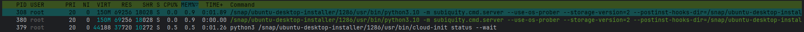
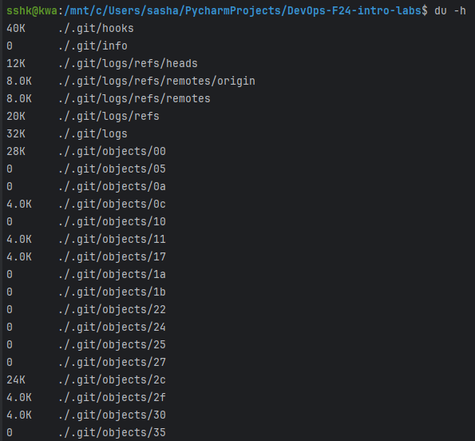

# GitOps & SRE Lab

## Task 1: Key Metrics for SRE and SLAs

### 1. Monitor System Resources

3 most consuming applications for CPU:

3 most consuming applications for memory:

3 most consuming applications for I/O:

### 2. Disk Space Management
Output of df -h command (the start of output):

Output of du -h command (the start of output):

Top 3 largest files in the `/var` directory:

