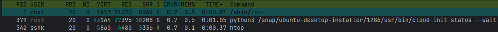
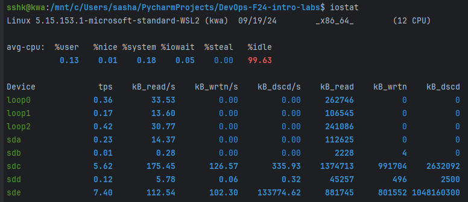
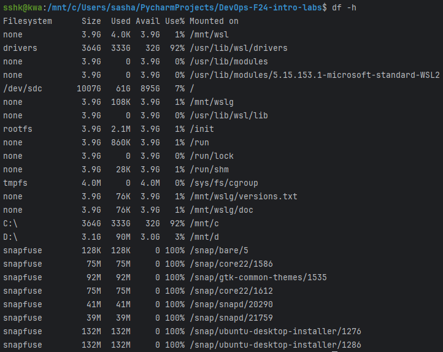
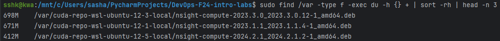

# GitOps & SRE Lab

## Task 1: Key Metrics for SRE and SLAs

### 1. Monitor System Resources

3 most consuming applications for CPU:

3 most consuming applications for memory:

Based on CPU and memory usage, we can see, that the system has been under low load, 
with top three applications consuming less than 1% of CPU and memory resources.
This is due to the WSL environment running on Windows, which is recently started and being used only for basic tasks of this lab.

3 most consuming applications for I/O:

Based on kB_read/s and kB_wrtn/s metrics, the most I/O consuming applications are:
- sde:
kB_read/s: 112.54
kB_wrtn/s: 102.30

- sdc:
kB_read/s: 175.45
kB_wrtn/s: 126.57

- loop0:
kB_read/s: 33.53
kB_wrtn/s: 0.00

These devices likely correspond to different partitions, virtual devices, or disks on the system and are not heavily loaded.

### 2. Disk Space Management
Output of df -h command (the start of output):

Output of du -h command (the start of output):

Top 3 largest files in the `/var` directory:

