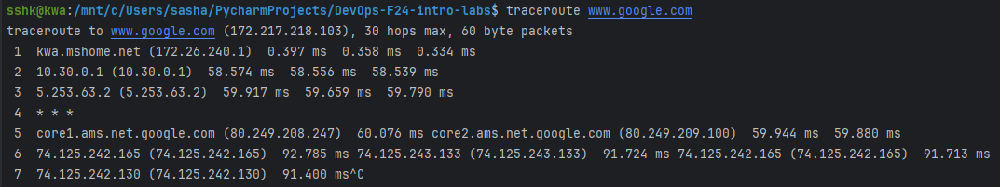
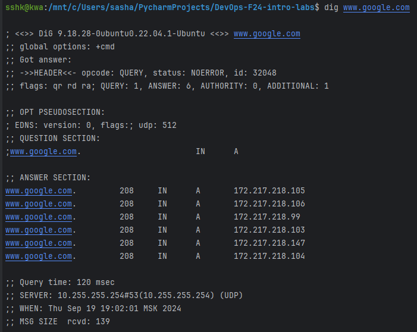

# Operating Systems & Networking Lab

## Task 1: Operating System Analysis

### 1. Analyze System boot time
```shell
system-analyze
```
Output:
```shell
Startup finished in 4.085s (userspace) 
graphical.target reached after 4.079s in userspace
```

```shell
systemd-analyze blame
```
Output: [blame_output.txt](outputs/blame_output.txt])

### 2. Check System Load and Uptime
```shell
uptime
```

Output:
```shell
  18:50:38 up  1:46,  2 users,  load average: 0.05, 0.04, 0.00
```

```shell
w
```

Output:
```shell
 18:51:02 up  1:46,  2 users,  load average: 0.03, 0.04, 0.00
USER     TTY      FROM             LOGIN@   IDLE   JCPU   PCPU WHAT
sshk     pts/1    -                17:04    1:46m  0.01s  0.01s -bash
root     pts/4    -                17:49    1:01m  0.01s  0.01s -bash
```

- Boot Time: The system boots efficiently with minimal delays. The system isn't burdened by any major boot delays, especially in the userspace processes.
- The apt-daily-upgrade.service is the largest contributor to boot delays, and addressing this can significantly improve startup performance. The other top services, such as motd-news and PostgreSQL, are also worth optimizing.
- System Load and Uptime: The system has been running for almost 2 hours, and the load is very light, with minimal user activity. The system is not under significant stress and is functioning optimally.

## Task 2: Networking Analysis

### 1. Traceroute
```shell
traceroute www.google.com
```


The traceroute reveals several hops between local machine and Google's server. 
There are 7 visible hops, including a jump to Google’s core network in Amsterdam (core1.ams.net.google.com).

The first hop, seems like my local router (kwa.mshome.net), has a very low latency of 0.397 ms.
Hop 4 shows * * *, indicating that this hop didn't respond.

Overall, the traceroute shows a relatively smooth network path to Google with a couple of latency spikes. 
The jump from around 60 ms to 92 ms in the last hops reflects the final connection to Google’s servers.

### 2. Dig
```shell
dig www.google.com
```



We can check that, by putting any of ip address of google.com in the browser, we can access the google.com website. 
This is because the DNS resolution is working correctly and resolving the domain name to the appropriate IP address.

Google’s DNS returns six different IP addresses for www.google.com. This is a common practice called DNS load balancing, 
where multiple IP addresses are provided to distribute incoming traffic across multiple servers.

The DNS query is served by 10.255.255.254, which is likely my local network’s DNS server.