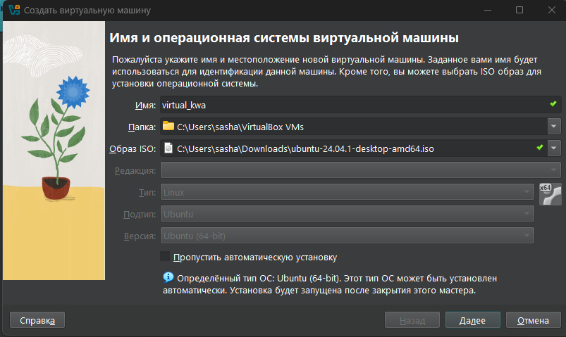
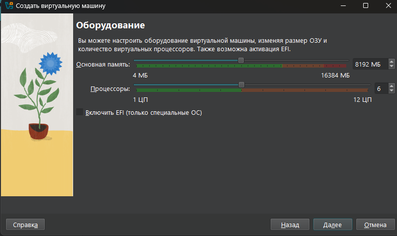
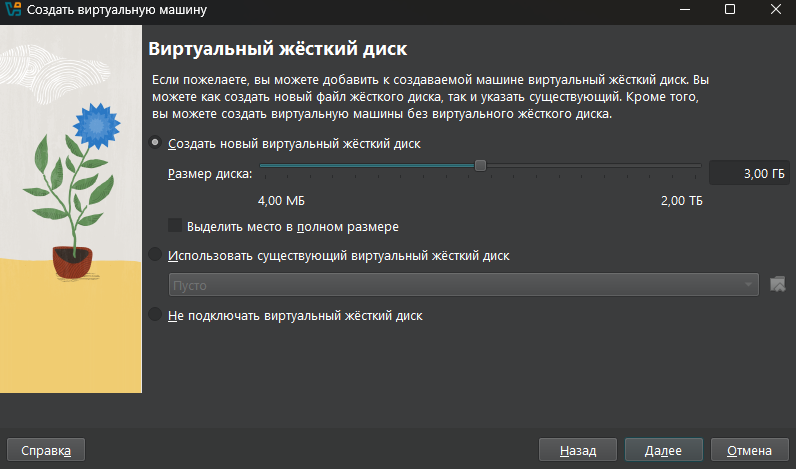
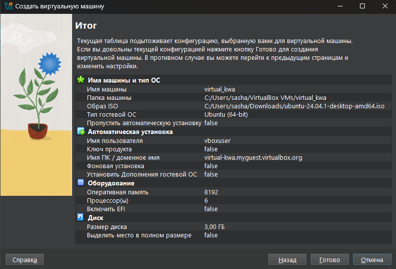
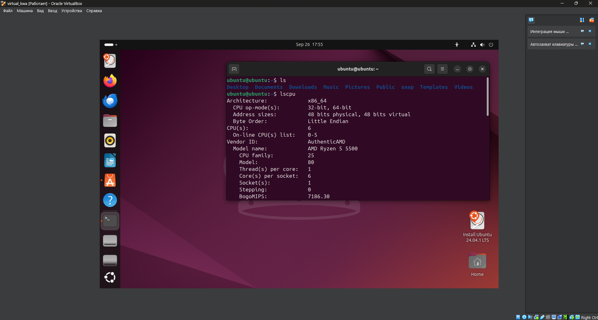
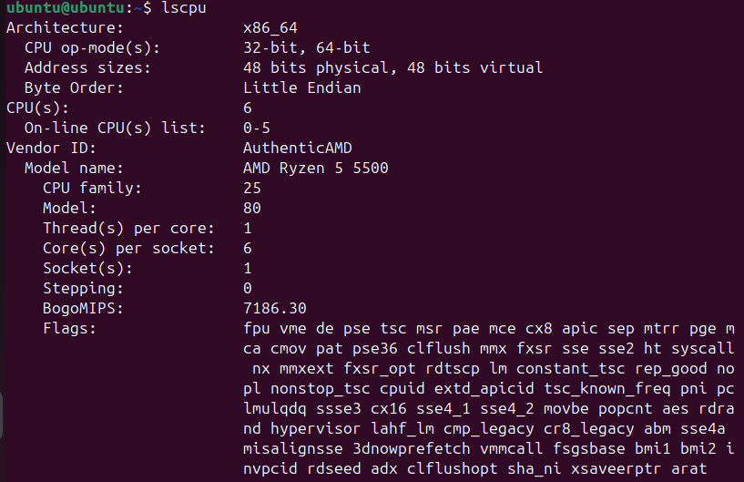
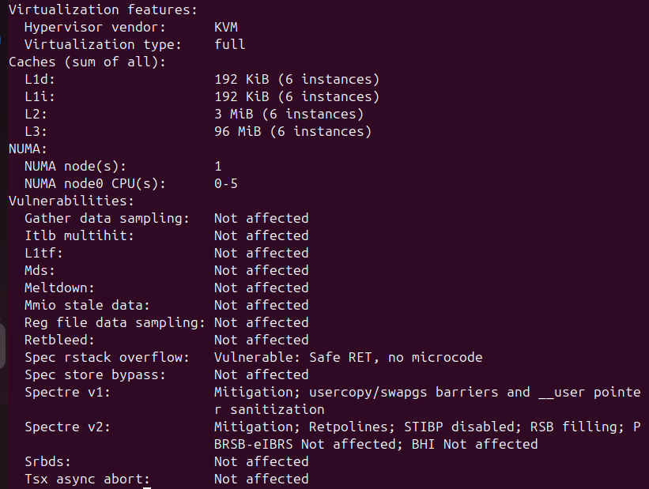
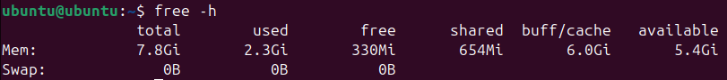
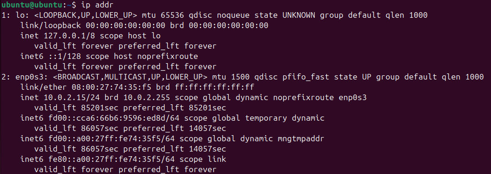
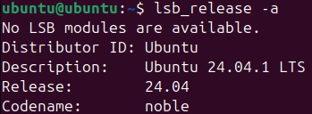

# Virtualization Lab

## Task 1: VM Deployment

### 1. Virtual Box version: 7.1.0

### 2. Deploying a VM
**Name of the VM**: virtual_kwa
- Installation of Ubuntu 20.04.1 LTS from pre-downloaded ISO file.

**VM settings:**
- RAM: 8192 MB
- CPU: 6 cores

**Virtual Disk Space:**
- Choosed to add a new virtual hard disk 
- Disk size: 3 GB

**Result:**

- **VM running:**

## Task 2: System Information Tools

### 1. Processor, RAM, and Network Information
**CPU:**
- Tool: lscpu
- Command: `lscpu`
- Output:

**RAM:**
- Tool: free
- Command: `free -h`
- Output:

**Network:**
- Tool: ip
- Command: `ip addr`
- Output:

### 2. Operating System Specifications
**OS:**
- Tool: lsb_release
- Command: `lsb_release -a`
- Output:

