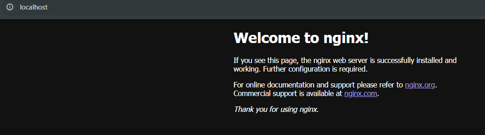
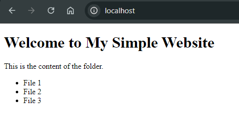

# Containers Lab - Docker

## Task 1: Container Management
### 1. List Containers
Specifically before this lab, I have cleaned up all the containers and images. So, there are no containers present in my environment. The command used to list the Docker containers is:
```sh
docker ps -a
```
The output of the command is:
```sh
CONTAINER ID   IMAGE     COMMAND   CREATED   STATUS    PORTS     NAMES
```

### 2. Pull Latest Ubuntu Image
```sh
docker pull ubuntu:latest
```
Output:
```
latest: Pulling from library/ubuntu
dafa2b0c44d2: Pull complete
Digest: sha256:dfc10878be8d8fc9c61cbff33166cb1d1fe44391539243703c72766894fa834a
Status: Downloaded newer image for ubuntu:latest
docker.io/library/ubuntu:latest

What's next:
    View a summary of image vulnerabilities and recommendations → docker scout quickview ubuntu:latest
```

### 3. Run Container
```sh
     docker run -it --name ubuntu_container ubuntu:latest
```
After running the above command, I am inside interactive session of the container with the following details:

```sh
docker ps -a
```

Output:
```
CONTAINER ID   IMAGE           COMMAND       CREATED         STATUS         PORTS     NAMES
203e8f48b03a   ubuntu:latest   "/bin/bash"   3 minutes ago   Up 3 minutes             ubuntu_container
```

### 4. Remove Image
I have tried to remove the image from the other terminal session:
```sh
docker rmi ubuntu:latest
```

Output:
```
Error response from daemon: conflict: unable to remove repository reference "ubuntu:latest" (must force) - container 203e8f48b03a is using its referenced image b1e9cef3f297
```

To remove the image, it is needed to remove the container first.


## Task 2: Image and Container Operations
### 1. Create Image Archive
```sh
docker save -o ubuntu_image.tar ubuntu:latest
```

Archived file size is 76.8 MB. 
The original image size is 78.1MB. 
The difference in size is due to the compression of the image layers.

### 2. Run Nginx Container
```sh
docker run -d -p 80:80 --name nginx_container nginx
```
Output:
```
Unable to find image 'nginx:latest' locally
latest: Pulling from library/nginx
a2318d6c47ec: Pull complete
095d327c79ae: Pull complete
bbfaa25db775: Pull complete
7bb6fb0cfb2b: Pull complete
0723edc10c17: Pull complete
24b3fdc4d1e3: Pull complete
3122471704d5: Pull complete
Digest: sha256:04ba374043ccd2fc5c593885c0eacddebabd5ca375f9323666f28dfd5a9710e3
Status: Downloaded newer image for nginx:latest
98ca3507cdd7224a730da0e81e740a492f489e555963e401d1594e872a2ef568
```

The Nginx web server is accessible from the local machine on http://localhost or http://localhost:80.


### 3. Create HTML File

We have an HTML file in the repo named `index.html`. We can copy this file to the Nginx container using the following command:
```sh
docker cp index.html nginx_container:/usr/share/nginx/html/index.html
```

Output:
```
Successfully copied 2.05kB to nginx_container:/usr/share/nginx/html/index.html
```

Now, the default Nginx page is replaced with the custom HTML page.


### 4. Create Custom Image
```sh
docker commit nginx_container my_website:latest
```
Output:
```
sha256:edcecbd97a26bc58d6c0225bd0266bd691be3d98d8a4d445e072d97d5adcfbe8
```

### 5. Remove Original Container
```sh
docker rm -f nginx_container
```
Output:
```
nginx_container
```

### 6. Create New Container
```sh
docker run -d -p 80:80 --name my_website_container my_website:latest
```
Output:
```
7f7cfde1abdc2dbeed2e64da067eb9c88207060a4847b1f120c50e2c13bef8f3
```

### 7. Test Web Server
```sh
curl http://127:0:0:1:80
```
Output:
```


StatusCode        : 200
StatusDescription : OK
Content           : <!DOCTYPE html>
                    <!-- You can modify it as you wish -->
                    <html>
                    <head>
                        <title>My Simple Website</title>
                    </head>
                    <body>
                        <h1>Welcome to My Simple Website</h1>
                        <p>This is the content o...
RawContent        : HTTP/1.1 200 OK
                    Connection: keep-alive
                    Accept-Ranges: bytes
                    Content-Length: 331
                    Content-Type: text/html
                    Date: Thu, 26 Sep 2024 18:53:56 GMT
                    ETag: "66da02f8-14b"
                    Last-Modified: Thu, 05 Sep 2024 ...
Forms             : {}
Headers           : {[Connection, keep-alive], [Accept-Ranges, bytes], [Content-Length, 331], [Content-Type, text/html]...}
Images            : {}
InputFields       : {}
Links             : {}
ParsedHtml        : System.__ComObject
RawContentLength  : 331


```


### 8. Analyze Image Changes
```sh
docker diff my_website_container
``` 

Output:
```
C /run
C /run/nginx.pid
C /etc
C /etc/nginx
C /etc/nginx/conf.d
C /etc/nginx/conf.d/default.conf
```
The diff command shows the changes made to the file system of the container relative to the original base image.
In our case, it is showing changes related to the Nginx web server process during the lifetime of container.
