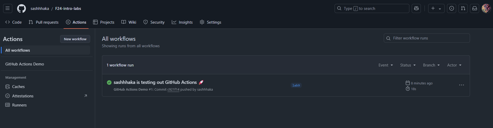
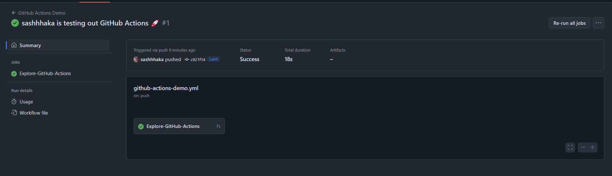
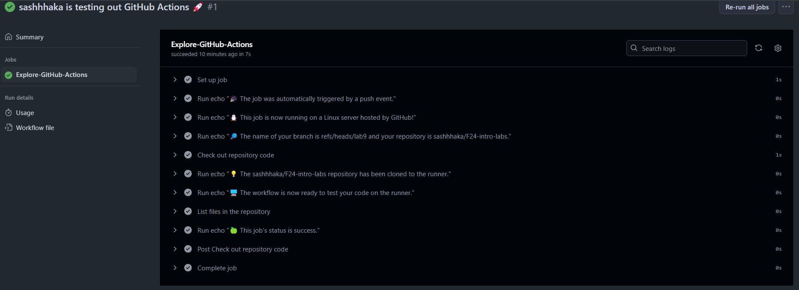
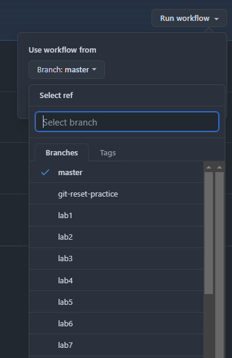
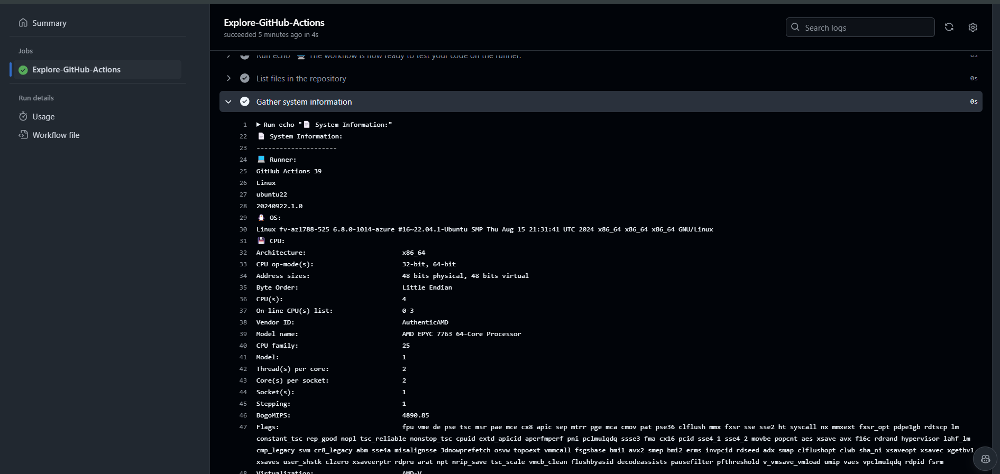

## Task 1: Create Your First GitHub Actions Pipeline

### 1. **Read the Official Guide**: 
#### 1. Key concepts:
- Events - triggers for the workflow;
- Job - executes on a runner machine and run a series of one or more steps;
- Step - individual task that can run commands (a written script or an existing action);

Events can be triggered by:
- Events inside the repository (push, pull request, issue, etc.);
- External events (webhooks, scheduled events, etc.);
- Manual triggers;
- Scheduled events.

Workflow syntax is defined with help of YAML files.

Additionally, in a workflow can be used advanced features like:
- Secrets - encrypted environment variables;
- Creating dependent jobs;
- Using a matrix to run a job in multiple configurations;
- Caching dependencies and build outputs;
- Using databases or service containers.

#### 2. Steps I have followed to run a demo workflow:
   - 1. I have created a file .github/workflows/github-actions-demo.yml in my repository and added the example code to it.
   - 2. I have pushed the changes to the repository and observed the GitHub Actions workflow execution.
   
   
### 2. **Observe the Workflow Execution**:
Firstly, we can observe the success of the pipeline in the commits section of the repository:


Secondly, we can observe the status of the pipeline in the Actions section of the repository:

Here are created jobs for the pipeline:

Here are the logs of the job:


By looking at the workflow file, we can see that it is a simple workflow that runs on the push event for the main branch. 
It has a single job that prints a messages to the console, checks out the repository code, lists the files in the repository, and prints the final workflow status.


## Task 2: Gathering System Information and Manual Triggering

1. **Configure a Manual Trigger**:
 - I have added a new triger to the workflow tag 'on': 'workflow_dispatch'.
As it was stated in documentation, this trigger will work only if the workflow file is in the default branch.
 - I have merged the branch lab9 into master and a button to trigger the workflow appeared in the Actions section of the repository.

We can also choose the branch from which we want to run the workflow:


2. **Gather System Information**:
 - I have added a new step to the workflow that prints the system information with name "Gather System Information".
At the start of the step several runner environment variables are printed, such as runner name, runner os, image version.
Then, the following commands are executed:
   - `uname -a` - prints system information;
   - `lscpu` - prints information about the CPU architecture;
   - `free -m` - prints information about memory usage;
   - `df -h` - prints information about disk space usage.
 - The output of the step is shown in the logs of the job:


The whole output of Gathering System Information step:
```
📄 System Information:
---------------------
‍💻 Runner:
GitHub Actions 39
Linux
ubuntu22
20240922.1.0
🐧 OS:
Linux fv-az1788-525 6.8.0-1014-azure #16~22.04.1-Ubuntu SMP Thu Aug 15 21:31:41 UTC 2024 x86_64 x86_64 x86_64 GNU/Linux
💾 CPU:
Architecture:                         x86_64
CPU op-mode(s):                       32-bit, 64-bit
Address sizes:                        48 bits physical, 48 bits virtual
Byte Order:                           Little Endian
CPU(s):                               4
On-line CPU(s) list:                  0-3
Vendor ID:                            AuthenticAMD
Model name:                           AMD EPYC 7763 64-Core Processor
CPU family:                           25
Model:                                1
Thread(s) per core:                   2
Core(s) per socket:                   2
Socket(s):                            1
Stepping:                             1
BogoMIPS:                             4890.85
Flags:                                fpu vme de pse tsc msr pae mce cx8 apic sep mtrr pge mca cmov pat pse36 clflush mmx fxsr sse sse2 ht syscall nx mmxext fxsr_opt pdpe1gb rdtscp lm constant_tsc rep_good nopl tsc_reliable nonstop_tsc cpuid extd_apicid aperfmperf pni pclmulqdq ssse3 fma cx16 pcid sse4_1 sse4_2 movbe popcnt aes xsave avx f16c rdrand hypervisor lahf_lm cmp_legacy svm cr8_legacy abm sse4a misalignsse 3dnowprefetch osvw topoext vmmcall fsgsbase bmi1 avx2 smep bmi2 erms invpcid rdseed adx smap clflushopt clwb sha_ni xsaveopt xsavec xgetbv1 xsaves user_shstk clzero xsaveerptr rdpru arat npt nrip_save tsc_scale vmcb_clean flushbyasid decodeassists pausefilter pfthreshold v_vmsave_vmload umip vaes vpclmulqdq rdpid fsrm
Virtualization:                       AMD-V
Hypervisor vendor:                    Microsoft
Virtualization type:                  full
L1d cache:                            64 KiB (2 instances)
L1i cache:                            64 KiB (2 instances)
L2 cache:                             1 MiB (2 instances)
L3 cache:                             32 MiB (1 instance)
NUMA node(s):                         1
NUMA node0 CPU(s):                    0-3
Vulnerability Gather data sampling:   Not affected
Vulnerability Itlb multihit:          Not affected
Vulnerability L1tf:                   Not affected
Vulnerability Mds:                    Not affected
Vulnerability Meltdown:               Not affected
Vulnerability Mmio stale data:        Not affected
Vulnerability Reg file data sampling: Not affected
Vulnerability Retbleed:               Not affected
Vulnerability Spec rstack overflow:   Vulnerable: Safe RET, no microcode
Vulnerability Spec store bypass:      Vulnerable
Vulnerability Spectre v1:             Mitigation; usercopy/swapgs barriers and __user pointer sanitization
Vulnerability Spectre v2:             Mitigation; Retpolines; STIBP disabled; RSB filling; PBRSB-eIBRS Not affected; BHI Not affected
Vulnerability Srbds:                  Not affected
Vulnerability Tsx async abort:        Not affected
🖥️ Memory:
               total        used        free      shared  buff/cache   available
Mem:            15Gi       692Mi        13Gi        23Mi       1.1Gi        14Gi
Swap:          4.0Gi          0B       4.0Gi
🏗️ Disk Space:
Filesystem      Size  Used Avail Use% Mounted on
/dev/root        73G   52G   21G  72% /
tmpfs           7.9G  172K  7.9G   1% /dev/shm
tmpfs           3.2G  1.1M  3.2G   1% /run
tmpfs           5.0M     0  5.0M   0% /run/lock
/dev/sdb15      105M  6.1M   99M   6% /boot/efi
/dev/sda1        74G  4.1G   66G   6% /mnt
tmpfs           1.6G   12K  1.6G   1% /run/user/1001
🌐 Network:
docker0: flags=4099<UP,BROADCAST,MULTICAST>  mtu 1500
        inet 172.17.0.1  netmask 255.255.0.0  broadcast 172.17.255.255
        ether 02:42:68:41:4b:0e  txqueuelen 0  (Ethernet)
        RX packets 0  bytes 0 (0.0 B)
        RX errors 0  dropped 0  overruns 0  frame 0
        TX packets 0  bytes 0 (0.0 B)
        TX errors 0  dropped 0 overruns 0  carrier 0  collisions 0

eth0: flags=4163<UP,BROADCAST,RUNNING,MULTICAST>  mtu 1500
        inet 10.1.0.36  netmask 255.255.0.0  broadcast 10.1.255.255
        inet6 fe80::222:48ff:fe25:b733  prefixlen 64  scopeid 0x20<link>
        ether 00:22:48:25:b7:33  txqueuelen 1000  (Ethernet)
        RX packets 9420  bytes 12101222 (12.1 MB)
        RX errors 0  dropped 0  overruns 0  frame 0
        TX packets 1521  bytes 570131 (570.1 KB)
        TX errors 0  dropped 0 overruns 0  carrier 0  collisions 0

lo: flags=73<UP,LOOPBACK,RUNNING>  mtu 65536
        inet 127.0.0.1  netmask 255.0.0.0
        inet6 ::1  prefixlen 128  scopeid 0x10<host>
        loop  txqueuelen 1000  (Local Loopback)
        RX packets 166  bytes 22951 (22.9 KB)
        RX errors 0  dropped 0  overruns 0  frame 0
        TX packets 166  bytes 22951 (22.9 KB)
        TX errors 0  dropped 0 overruns 0  carrier 0  collisions 0
🚦 CPU Load and Usage:
top - 16:41:53 up 2 min,  0 users,  load average: 0.03, 0.05, 0.02
Tasks: 164 total,   1 running, 163 sleeping,   0 stopped,   0 zombie
%Cpu(s): 20.6 us,  1.6 sy,  0.0 ni, 77.8 id,  0.0 wa,  0.0 hi,  0.0 si,  0.0 st
MiB Mem :  15990.0 total,  14206.4 free,    694.1 used,   1089.5 buff/cache
MiB Swap:   4096.0 total,   4096.0 free,      0.0 used.  14926.3 avail Mem 

    PID USER      PR  NI    VIRT    RES    SHR S  %CPU  %MEM     TIME+ COMMAND
   1699 runner    20   0 3727796 128600  54236 S  86.7   0.8   0:01.92 Runner.+
      1 root      20   0  167716  12664   8056 S   0.0   0.1   0:02.52 systemd
      2 root      20   0       0      0      0 S   0.0   0.0   0:00.00 kthreadd
```